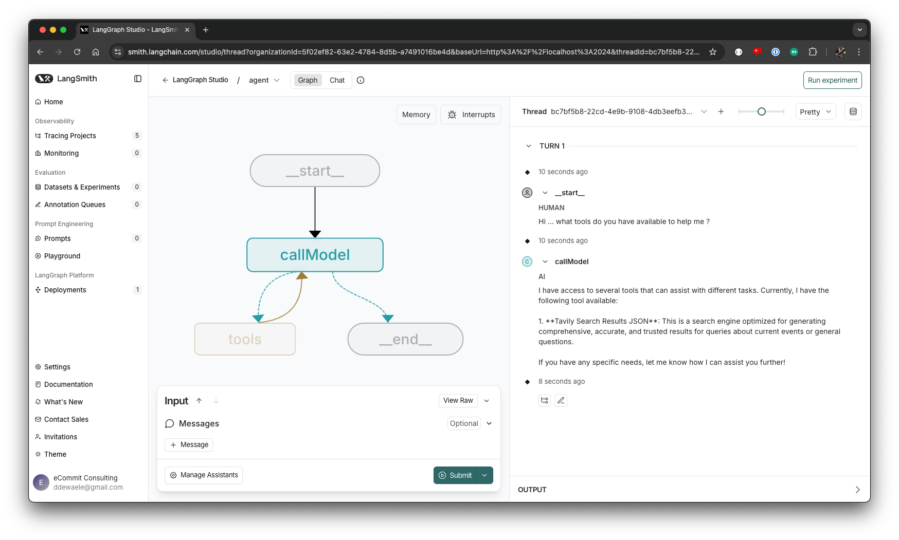

# A very simple LangGraph deploment

This repo is the most simplistic repo you can make to

- exposes a single agent 
- deployable on your local machine for easy development and debugging 
- deployable on the LangGraph platform.

The idea of this repo is to show you the steps to create everything from scratch, using the conventions outlined by LangGraph in the following page : https://langchain-ai.github.io/langgraphjs/cloud/deployment/setup_javascript/#specify-environment-variables


## npm init

The project was started using `npm init`

```
base ❯ npm init -y
Wrote to /Users/davydewaele/Projects/AgenticAI/nestjs-mcp/langgraph-platform-simple-agent/package.json:

{
"name": "langgraph-platform-simple-agent",
"version": "1.0.0",
"main": "index.js",
"scripts": {
"test": "echo \"Error: no test specified\" && exit 1"
},
"keywords": [],
"author": "",
"license": "ISC",
"description": ""
}
```

## tsc init

As the project will be written in typescript, we will go ahead and create a `tsconfig.json` file

```
tsc --init

Created a new tsconfig.json with:
TS
target: es2016
module: commonjs
strict: true
esModuleInterop: true
skipLibCheck: true
forceConsistentCasingInFileNames: true
```

We will make the following changes to the tsconfig :  

- toplevel : `"include": ["src/**/*"],` 
- compilerOptions : `"outDir": "./dist"`

## Dependencies

We will add the following dependencies

```
npm install @langchain/core \ 
    @langchain/langgraph \
    @langchain/community \
    @langchain/openai \
    @langchain/tavily 
```

**Important Note : ** there is an issue with the current version of LangGraph Platform and the LangChain Tavily integration.
At the time of writing, the version of zod that is shipped with @langchain/tavily results in timeouts during schema generation when running the application locally.


## Project structure

We will be following the conventions outlined in this article 

https://langchain-ai.github.io/langgraphjs/cloud/deployment/setup_javascript/#specify-environment-variables

This means we will have the following structure

```
.
├── dist                # Compiled JavaScript output from TypeScript sources                    
│   └── agent.js        # Generated JavaScript code for the agent (built from src/agent.ts)
├── langgraph.json      # Deployment descriptor for LangGraph platform
├── node_modules        # Installed NPM dependencies (auto-managed, should be ignored by git)
├── package-lock.json   # Lock file to ensure consistent installs across environments
├── package.json        # Project manifest: scripts, dependencies, metadata
├── README.md           # What you are reading now
├── src                 # Source directory containing the TypeScript implementation
│   └── agent.ts        # ain TypeScript file defining the agent behavior and tool bindings
└── tsconfig.json       # TypeScript compiler configuration (defines input/output, module settings, etc.)
```

## LangGraph deployment descriptor

```
{
  "node_version": "20",
  "dockerfile_lines": [],
  "dependencies": ["."],
  "graphs": {
    "agent": "./src/agent.ts:graph"
  },
  "env": ".env"
}
```

## Agent code
   
Our simple agent code is located in `src/agent.ts` as described in https://langchain-ai.github.io/langgraphjs/tutorials/quickstart/#customizing-agent-behavior 

```
import {AIMessage, HumanMessage} from "@langchain/core/messages";
import { ChatOpenAI } from "@langchain/openai";
import { TavilySearchResults } from "@langchain/community/tools/tavily_search";
import { MessagesAnnotation, StateGraph } from "@langchain/langgraph";
import { ToolNode } from "@langchain/langgraph/prebuilt";

const tools = [new TavilySearchResults({ maxResults: 3 })];

async function callModel(state: typeof MessagesAnnotation.State) {

    const model = new ChatOpenAI({
        model: "gpt-4o",
    }).bindTools(tools);

    const response = await model.invoke([
        {
            role: "system",
            content: `You are a helpful assistant. The current date is ${new Date().getTime()}.`,
        },
        ...state.messages,
    ]);

    return { messages: response };
}

function routeModelOutput(state: typeof MessagesAnnotation.State) {
    const messages = state.messages;
    const lastMessage: AIMessage = messages[messages.length - 1];
    if ((lastMessage?.tool_calls?.length ?? 0) > 0) {
        return "tools";
    }
    return "__end__";
}

const workflow = new StateGraph(MessagesAnnotation)
    .addNode("callModel", callModel)
    .addNode("tools", new ToolNode(tools))
    .addEdge("__start__", "callModel")
    .addConditionalEdges(
        "callModel",
        routeModelOutput,
        ["tools", "__end__"]
    )
    .addEdge("tools", "callModel");

export const graph = workflow.compile();

```
## Running locally

Running the `npx @langchain/langgraph-cli dev` will launch a webbrowser where you will be able to see your agent.

```
base ❯ npx @langchain/langgraph-cli dev

          Welcome to

╦  ┌─┐┌┐┌┌─┐╔═╗┬─┐┌─┐┌─┐┬ ┬
║  ├─┤││││ ┬║ ╦├┬┘├─┤├─┘├─┤
╩═╝┴ ┴┘└┘└─┘╚═╝┴└─┴ ┴┴  ┴ ┴.js

- 🚀 API: http://localhost:2024
- 🎨 Studio UI: https://smith.langchain.com/studio?baseUrl=http://localhost:2024

This in-memory server is designed for development and testing.
For production use, please use LangGraph Cloud.


info:    ▪ Starting server...
info:    ▪ Initializing storage...
info:    ▪ Registering graphs from /Users/davydewaele/Projects/AgenticAI/nestjs-mcp/langgraph-platform-simple-agent
info:    ┏ Registering graph with id 'agent'
info:    ┗ [1] { graph_id: 'agent' }
info:    ▪ Starting 10 workers
info:    ▪ Server running at ::1:2024
info:    ▪ <-- GET /assistants/fe096781-5601-53d2-b2f6-0d3403f7e9ca
info:    ▪ --> GET /assistants/fe096781-5601-53d2-b2f6-0d3403f7e9ca 200 1ms
info:    ▪ <-- GET /assistants/fe096781-5601-53d2-b2f6-0d3403f7e9ca/schemas
info:    ▪ <-- POST /assistants/search
info:    ▪ --> POST /assistants/search 200 2ms
info:    ▪ <-- GET /info
info:    ▪ --> GET /info 200 1ms
info:    ▪ <-- POST /assistants/search
info:    ▪ --> POST /assistants/search 200 1ms
info:    ▪ <-- GET /assistants/fe096781-5601-53d2-b2f6-0d3403f7e9ca/subgraphs?recurse=true
info:    ▪ --> GET /assistants/fe096781-5601-53d2-b2f6-0d3403f7e9ca/subgraphs?recurse=true 200 1ms
info:    ▪ <-- GET /assistants/fe096781-5601-53d2-b2f6-0d3403f7e9ca/graph?xray=true
info:    ▪ --> GET /assistants/fe096781-5601-53d2-b2f6-0d3403f7e9ca/graph?xray=true 200 2ms
info:    ▪ --> GET /assistants/fe096781-5601-53d2-b2f6-0d3403f7e9ca/schemas 200 2s
info:    ▪ <-- POST /assistants/search
info:    ▪ --> POST /assistants/search 200 0ms

```

Your browser should show something like this



## References

- https://www.danielcornock.co.uk/articles/bootstrap-typescript-1-ts-initialisation
- https://langchain-ai.github.io/langgraphjs/cloud/deployment/setup_javascript/#specify-environment-variables
